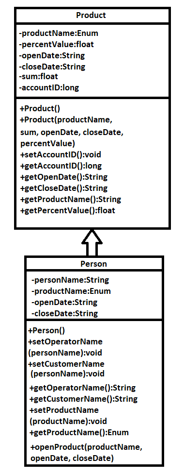

# Индивидуальный проект по тематике банковского приложения
В ходе проекта будут разработаны удобные для работы "сотрудника" и "пользователя" классы и методы. Также будет создано разнообразие банковских продуктов. На данном этапе невозможно предусмотреть не только все методы и свойства классов, но также и количество классов в целом. Первое время я буду ориентироваться на схему, представленную ниже, однако позже проект будет развиваться и содержать всё большее и большее количество объектов.

